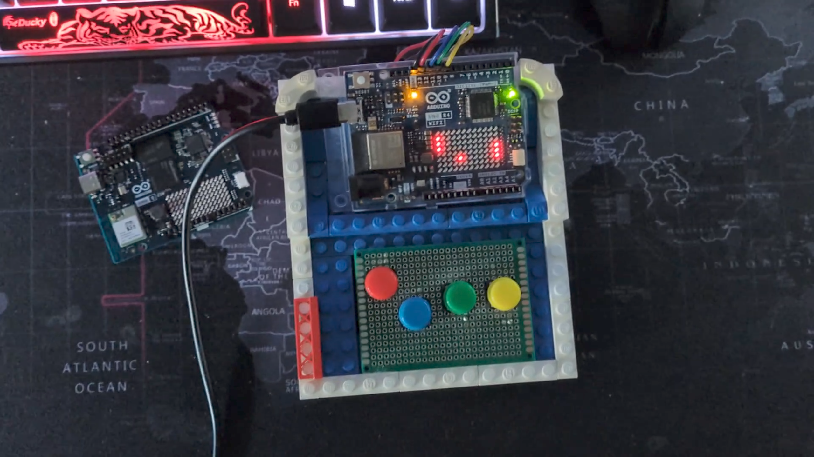

# 🏓 Arduino UNO R4 WiFi Pong

A classic implementation of the Pong game developed specifically for the Arduino UNO R4 WiFi, utilizing its built-in 12×8 LED matrix as the game screen.

# 📹 Preview

Youtube: https://youtu.be/ouLBTDjpKqc

# 📝 Description

This project transforms your Arduino board into a minimalist handheld console. By leveraging the Arduino_LED_Matrix library, the game manages ball physics, collision detection with walls and paddles, and a scoring system displayed via the Serial Monitor.

Key Features:

- Integrated Display: No external modules required; it uses the native 12×8 LED matrix.
- Local Multiplayer: Two-player support using 4 external pushbuttons.
- Dynamic Difficulty: The ball speed periodically increases to keep the gameplay challenging.
- Real-time Scoring: Points are tracked and sent via Serial (9600 baud).

# 🛠️ Hardware Requirements

- Board: Arduino UNO R4 WiFi.
- Buttons: 4x Momentary Pushbuttons.
- Resistors: Not required (uses internal INPUT_PULLUP).
- Breadboard & Jumper wires.

# 🖮 Pinout Configuration

Component	Arduino Pin	Function

- P1 Button Up	D13	Moves Left Paddle Up
- P1 Button Down	D12	Moves Left Paddle Down
- P2 Button Up	D11	Moves Right Paddle Up
- P2 Button Down	D10	Moves Right Paddle Down
- Common GND	GND	Ground for all buttons

# 🕹️ Game Logic

- Bouncing: When the ball hits a paddle, the X direction is reversed and the hits counter increases.
- Speed Scaling: Every 6 successful hits (hits >= 6), the loop_delay decreases by 20ms, speeding up the action until a minimum limit of 80ms is reached.
- Scoring: If a player misses the ball, the opponent scores a point. The ball then resets to the center with a randomized direction.
